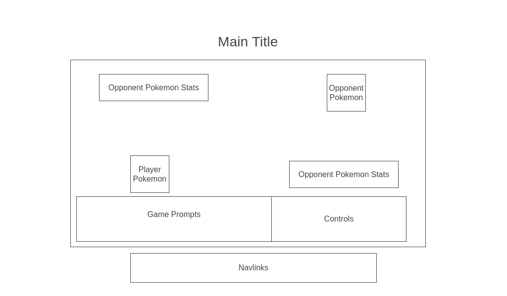

# Pokemon-Battle

## Background
Pokemon Battle! is a recreation of the one-on-one Pokemon battling functionality that is a staple of modern Pokemon games. It allows trainers to battle their respective Pokemon, using their knowledge of type weaknesses, items, and battling mechanics to triumph (or run) over their opponents.  

The classic Pokemon battling functionality pits two trainers against each other, where they are able to select a Pokemon to battle, when to use items, and when to switch Pokemon in addition to choosing one of four possible attacks for each Pokemon. This clone will retain the battling (attack) functionality and use of items but will forgo the ability to switch Pokemon. Instead, the player will pick one of three Pokemon from the start menu and battle using that Pokemon against a single opposing Pokemon.  

## Functionality & MVPs

In Pokemon Battle!, users will be able to:

• Choose one of three Pokemon to use from the start menu  
• Choose an attack to use on the opposing Pokemon  
• Choose an item to use in battle to heal their Pokemon  
• Play and pause music • Exit or restart the game  

In addition, this project will include:  

• An about modal describing the background and instructions for the game!  
• A production README

## Wireframe

  

• Game controls will allow the user to select and attack or item for their pokemon. Additionally, it will allow them to    play/pause music and exit/reset the game.  
• Horizontally adjacent to each Pokemon there will be stats that display that Pokemon's name, level, and health.  
• On the top right and bottom right corners, each Pokemon will be displayed with the player's Pokemon on the bottom  
• Nav links include links to this project's Github repo, my LinkedIn and AngelList, and the About modal.

## Technologies, Libraries, APIs
• Canvas API to render the battle  
• PokeAPI to retrieve Pokemon stats such as available attacks, weaknesses, and health  
• Webpack to bundle and transpire the source Javascript Code  
• npm to manage project dependencies

## Implementation Timeline
• **Friday Afternoon & Weekend**: Draft project UML and familiarize with Canvas API. Read over PokeAPI documentation. Get Canvas up and running and create the Game, Pokemon, and Attack classes. Be able to render Pokemon on the screen in the correct positions.

• **Monday**: Mildly Panic. Make sure that Pokemon each Pokemon has the correct attacks available to the user and that Pokemon can attack each other.

• **Tuesday**: Implement user controls such as play/pause music, main menu to allow the user to pick their Pokemon, exit/restart the game.

• **Wednesday**: Focus on bug fixes and styling.

• **Thursday**: Deploy to Github Pages.

## Bonus Features
Some anticipated updates for the future are:  
• Adding multiple Pokemon as an avilabile option, up to and including of of generation 1 (first 150 Pokemon)  
• Adding ability to choose opposing Pokemon  
• Two-Player functionality
